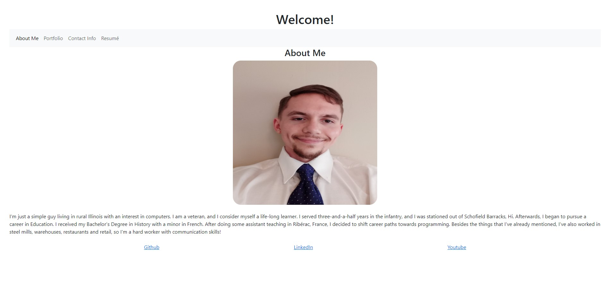

# React Portfolio

## Description

This app was created, so I could practice using React. It can also act as a portfolio to show potential employers. I learned that I desperately need to study React States.

## Installation

The React library is the only necessary package.

## Usage

Click on the different links in the Navbar to render different components. Afterwards, read and enjoy the presented materials!

